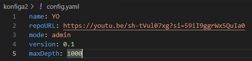
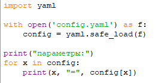
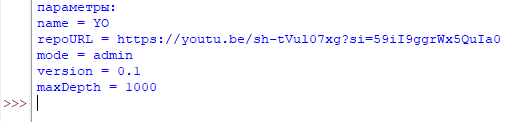
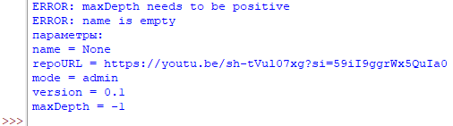
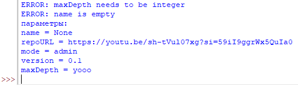
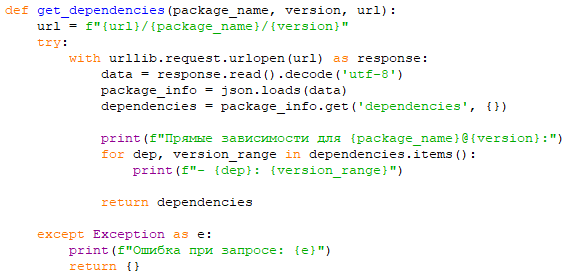
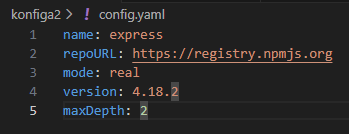
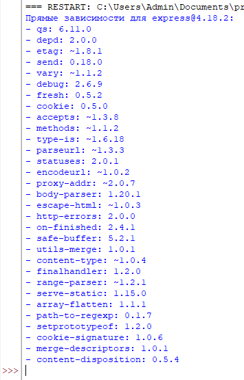

## Терентьев Алексей Ильич ИКБО-20-24
### Вариант 28
#### Этап 1
Создан конфигурационный файл формата yaml с заданными параметрами:
### 
Написана программа на python, которая считывает файл config.yaml и выводит его параметры:
### 
Результат работы программы:
### 
Реализована обработка ошибок для параметров: ошибка пустого значения в параметре и неправильный тип параметра maxDepth
### 
### 
#### Этап 2
Написана функция получения зависимостей для реальных пакетов:
### 
Вывод при вызове функции с параметрами из конфигурационного файла:

Конфигурационный файл:
### 
Вывод программы:
### 
Пример ошибки при поиске зависимостей (взят прошлый пример с измененным именем пакета - yo):
### 
